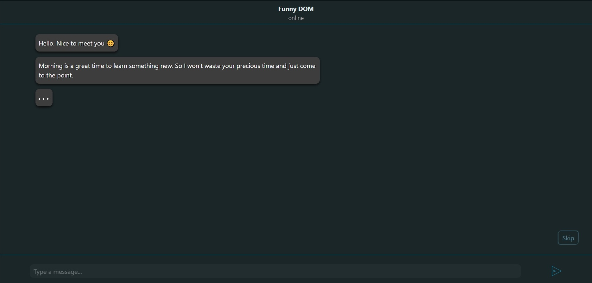
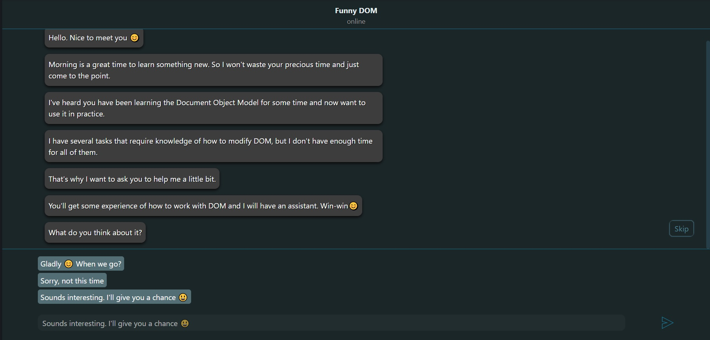
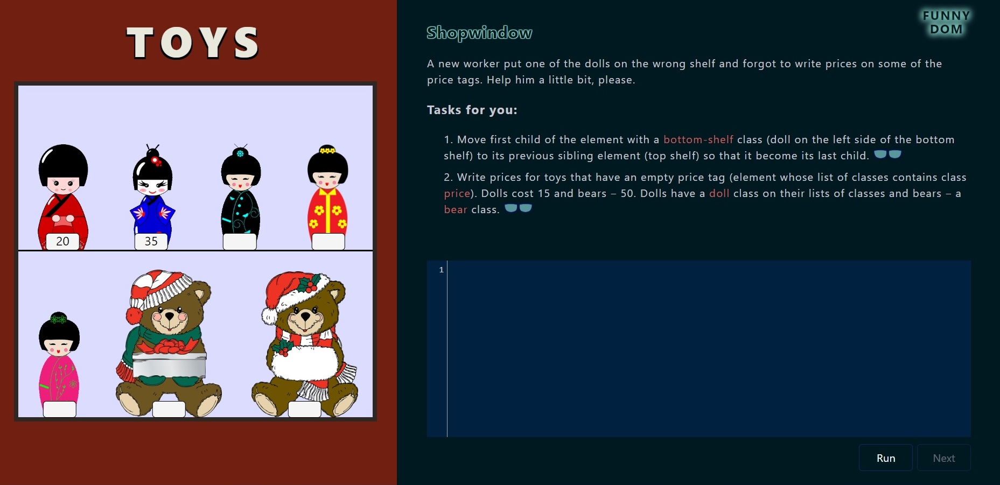
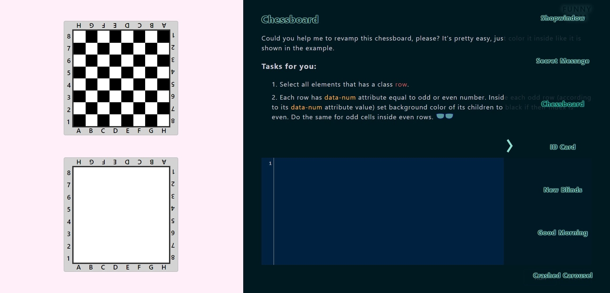

# Funny DOM
> Funny DOM is a web application where user can check and improve his/her knowledge of issues connected to DOM manipulations.

## Table of contents
- [Funny DOM](#funny-dom)
  - [Table of contents](#table-of-contents)
  - [General info](#general-info)
  - [Screenshots](#screenshots)
  - [Technologies](#technologies)
  - [Status](#status)

## General info 
Funny DOM is an application where you can learn DOM manipulations without opening your code editor. Online code editor and page on which code would be applied are located at the same place. It means that you can do exercises even in your smartphone's browser. The correctness of your solution is checked based on the effects that your code causes in pages functionality or appearance. Every challenge contains a list of smaller tasks each of which is checked independently from the others. When all tasks from the list are finished the whole challenge gets status of completed and you can go to the next one.

I didn't add hints that contain ready code, but for some tasks you will get links to MDN documentation of methods that can be used in your solution.

You can always play with other things that are not included in tasks' list. It will not affect your result until given tasks are done correctly. I don't want to impose only one solution because there are a lot of different ways to do the same thing. Everything depends on you.

Switching to the next challenges you will still have access to previously finished challenges. But remember, that your solutions are not saved so you won't be able to see them after switching to another task.

Before I started this project I wanted to just create a list of tasks for myself to check my skills from DOM manipulations after some time but then I decided to share these tasks with others. At this moment challenges don't cover the whole range of knowledge but I'm going to make scope wider.

## Screenshots

## Technologies
* JavaScript
* HTML
* SCSS
* Webpack 4
* [CodeMirror](https://codemirror.net/)

## Status
Project is _finished_ at this moment. In the future I plan to add more challenges.